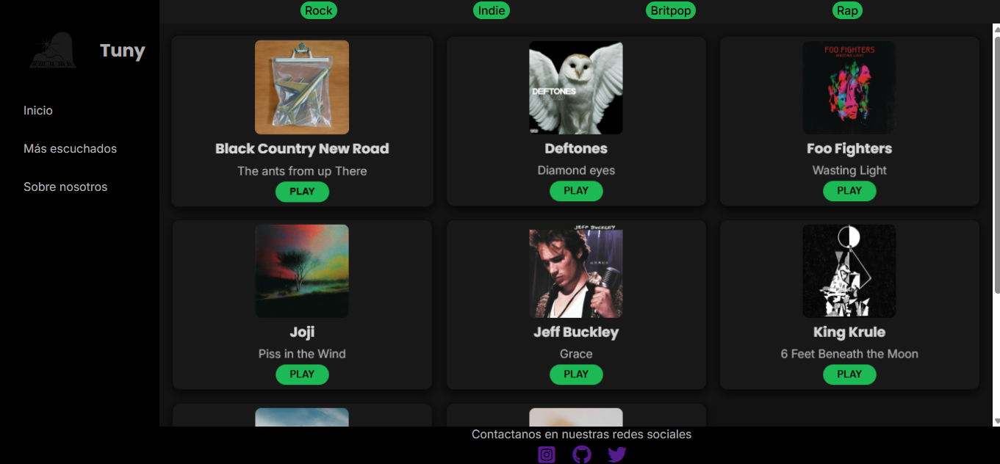

# Tuny

Tuny es una plataforma web de reproducción de música, inspirada en interfaces como Spotify y YouTube Music. El proyecto fue desarrollado utilizando HTML y CSS puro, siguiendo principios de diseño mobile-first, con CSS Grid y Flexbox para la estructura del layout.

## Vista previa

## Demo

Puedes ver el proyecto en funcionamiento aquí: [LINK_DE_GITHUB_PAGES](https://camlo77.github.io/Prueba-3/)

## Características

- Diseño responsivo (mobile-first) con un layout adaptado para escritorio mediante CSS Grid
- Menú lateral de navegación en pantallas grandes, con menú colapsable en móvil
- Sección de géneros musicales en el header
- Catálogo de álbumes en formato de tarjetas (cards), con animaciones al pasar el cursor
- Sistema de paginación
- Footer con enlaces a redes sociales

## Tecnologías utilizadas

- HTML5
- CSS3 (Grid, Flexbox, animaciones y transiciones)
- Font Awesome (iconos)
- Google Fonts (Inter, Poppins)